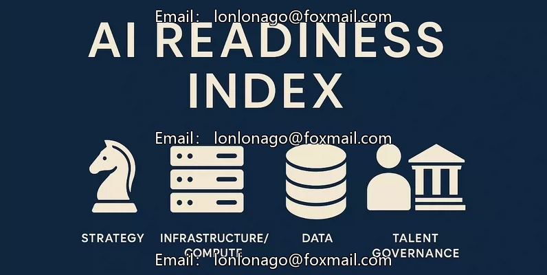
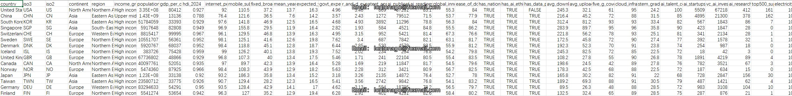
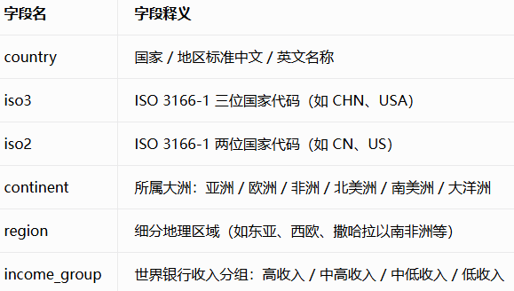
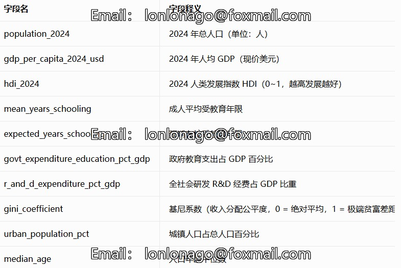
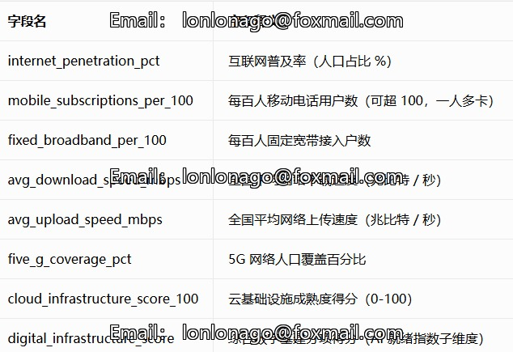
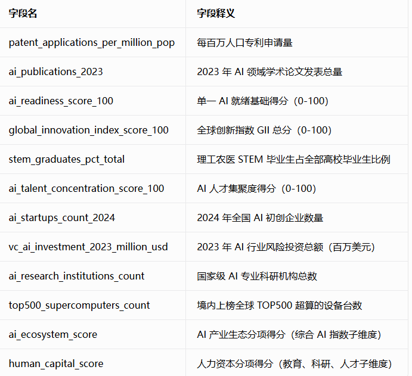
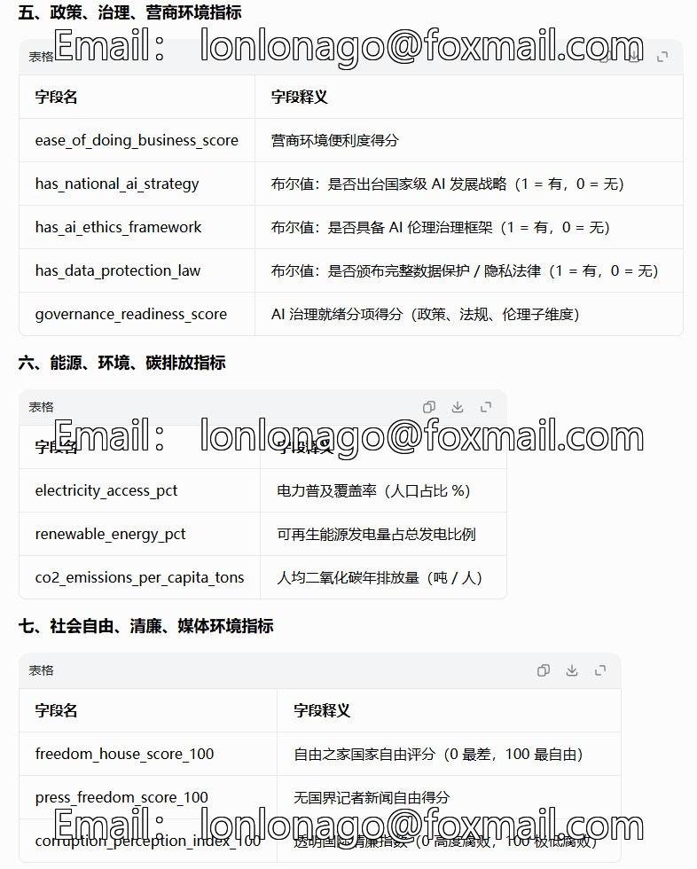

## Body

Global Artificial Intelligence Readiness and Digital Economy Index

115 countries, 50 dimensions, across 6 continents, with 10 data sources—this is the most comprehensive dataset on artificial intelligence readiness to date.

Why is this dataset important? Governments, researchers, and businesses are all asking the same question: Which countries are at the forefront of the AI revolution, while others are lagging behind?
This dataset addresses this issue by integrating real data from 10 authoritative international sources into a single, usable file for analysis. There is no such resource available anywhere online.

Each data point comes from publicly accessible and verifiable databases:
Source   Data provider     URL
World Bank World Development Indicators   GDP, population, education, broadband, research and development, electricity data  data.worldbank.org
United Nations Human Development Report    Human Development Index, years of schooling, life expectancy hdr.undp.org
International Telecommunication Union (ITU)    Internet penetration rate, mobile users, broadband itu.int/en/ITU-D/Statistics
Oxford Insights    Government Artificial Intelligence Readiness index oxfordinsights.com/ai-readiness
World Intellectual Property Organization Global Innovation Index    Innovation score, patent data wipo.int/global_innovation_index
OECD Global Speed Test Index    Download/upload speeds by country speedtest.net/global-index
Stanford Artificial Intelligence Index    Artificial intelligence publications, investment data aiindex.stanford.edu
Tortoise Media Global Artificial Intelligence Index    Artificial intelligence talent, infrastructure, research tortoisemedia.com/intelligence/global-ai
Freedom House    Freedom scores, news freedom freedomhouse.org
Transparency International    Corruption perception index transparency.org/cpi

## Images

Here is a pay link on Stripe ( https://buy.stripe.com/3cs8yP7sY87d0vu9AB ). Please contact me lonlonago@foxmail.com after funding $89, and I will send you a complete data files , thank you!

